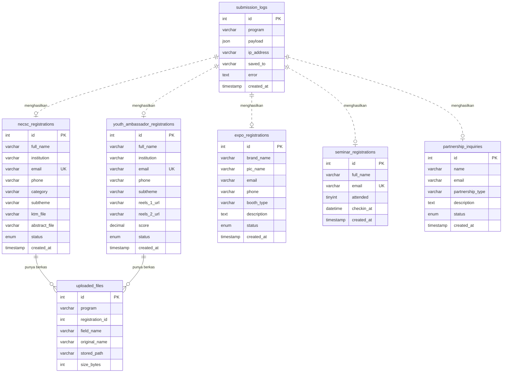

# Diagram Relasi — green_impact_festival

Lima tabel pendaftaran berdiri sendiri (tidak saling bergantung), didampingi
`submission_logs` sebagai catatan mentah dan `uploaded_files` sebagai penampung
metadata berkas.

## Catatan desain

**Kenapa tidak satu tabel `registrations` untuk semua program?**
Field tiap program berbeda jauh — NECSC butuh abstrak & kategori, Youth
Ambassador butuh dua link reels, Expo butuh jenis booth. Digabung jadi satu
tabel akan menghasilkan banyak kolom kosong dan menyulitkan panitia saat
mengekspor ke Excel. Rekap lintas program tetap mudah lewat view
`v_semua_pendaftar`.

**Kenapa relasi `uploaded_files` tidak pakai FOREIGN KEY?**
Karena satu tabel berkas melayani lima tabel pendaftaran sekaligus (pola
polymorphic), pasangan `program` + `registration_id` dipakai sebagai penanda
pemilik. Konsekuensinya integritas dijaga di sisi aplikasi, bukan oleh MySQL.

**Kenapa `submission_logs` tidak punya FOREIGN KEY ke tabel pendaftaran?**
Log ditulis lebih dulu, sebelum diketahui apakah penyimpanan berhasil. Kolom
`saved_to` mencatat tabel tujuan bila sukses, dan `error` mencatat alasannya
bila gagal.
